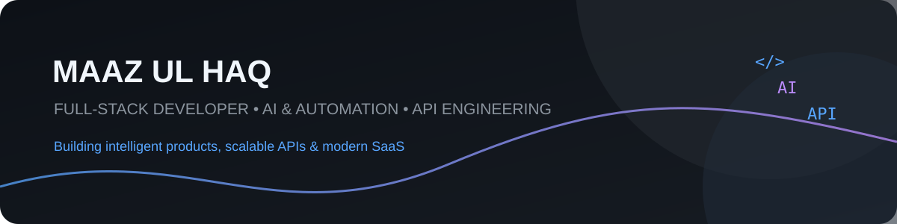

# Maaz Ul Haq 👋

### Full-Stack & AI Product Engineer

**Building intelligent products, scalable APIs, automation and SaaS.**

---

## 🚀 About Me

I'm a **Full-Stack & AI Product Engineer** focused on turning ideas into practical, production-ready digital products.

My work combines **frontend engineering, backend systems, REST APIs, AI-powered workflows, automation, integrations, and SaaS product development**.

- 🧠 AI-powered applications and intelligent workflows
- ⚙️ Backend systems, REST APIs and business logic
- 💻 Full-stack web application development
- 🔌 Third-party API and service integrations
- 🚀 SaaS and MVP-to-production product engineering
- 🛠️ Developer tools and productivity platforms

---

## 🛠️ Tech Stack

---

## 💡 What I Build

<table>
<tr>
<td width="50%">

### Full-Stack Products

Modern web applications with frontend, backend, database, authentication, APIs and integrations working together as one product.

</td>
<td width="50%">

### AI & Automation

AI-powered features, intelligent workflows, agents and automation designed around practical product use cases.

</td>
</tr>
<tr>
<td width="50%">

### API Engineering

REST APIs, backend services, external provider integrations, authentication and application business logic.

</td>
<td width="50%">

### SaaS & Product Engineering

From product idea and architecture to MVP implementation, iteration and production-ready systems.

</td>
</tr>
</table>

---

## 🚀 Selected Public Products

<table>
<tr>
<td width="33%" align="center">

### 🧰 DevBox

**Developer productivity toolkit**

A browser-first collection of practical tools for JSON, JWT, UUID, hashing, regex, SQL, URLs, QR codes, Markdown and more.

</td>
<td width="33%" align="center">

### 🎨 CreatorOS

**AI creative workspace**

A creator-focused workflow covering briefs, AI creative concepts, editing, multi-platform repurposing, asset management and sharing.

</td>
<td width="33%" align="center">

### 🍳 Cook Tonight

**Budget-aware meal decision engine**

Helps people decide what to cook based on ingredients they already have, budget, number of people, missing ingredients and preparation time.

</td>
</tr>
</table>

### 🏷️ DealRadar

**Deal discovery & product intelligence platform**

External provider integrations · REST APIs · Data workflows · Full-stack application

---

## 🎯 Current Focus

- AI-powered product development
- Autonomous and semi-autonomous AI agents
- API-first application architecture
- Full-stack SaaS development
- Automation and intelligent workflows
- Developer productivity tools
- Turning MVPs into production-ready products

---

## 🤝 Connect

**Open to interesting products, technical challenges and collaboration.**

**Build · Automate · Ship · Improve 🚀**

